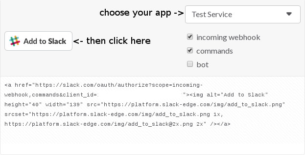

Making your own application
---------------------------

In the previous example we've learned how to send message with action buttons. Before we can handle any communication we must first register our application.

This example covers **_very_** narrow area of developing application on Slack. We will only do what's needed to make buttons respond to user's mouse clicks.

Let's begin.

1. You need to create your application [here](https://api.slack.com/apps).
    
    Click on 'Create New App' button and fill all information needed.
    
    On the first page you have the most important data.
    
    Client ID and Client Secret alongside with Code you will get later from OAuth GET request are necessary to install app on your channel.
     
    Below you can add description and other information that will be necessary if you plan to add your app to the App Directory and make it available for everyone, however it's useless for now.

2.  Now you need to set up Redirect URL for OAuth and permissions your app requires.

    Click on "OAuth & Permissions" on the left panel then scroll down and add permissions scopes.
    
    Add permissions for 'incoming_messages' and 'commands' first.
    
    As for Redirect URL you have two possibilities. 
    
    - One is temporary and involves third party website such as [RequestBin](https://requestb.in/) to generate the Request URL and some tool to send Requests like [Insomnia](https://insomnia.rest/) or curl. 
    
    - The other one is to set your website to respond for request and then call MessageService. You can copy-paste example below but remember to change parameters for sendAuthentication method.
    
    ```php
    $messageService = ClawRock\Slack\SlackFactory::getMessageService('https://slack.com/api/oauth.access');
    
    $logService = ClawRock\Slack\SlackFactory::getLoggerInstance();

    $code = $_GET['code'];

    $response = $messageService->sendAuthentication('your-app-client-id', 'your-app-client-secret', $code);

    $logService->addDebug($response);
    ```
    
    **IMPORTANT!** Your response will be saved under logs/ directory. You can find your Incoming Webhook URL there. 
    
    To make a request with the code you must click 'Add to Slack' [Button](https://api.slack.com/docs/slack-button).
     
    
     
    This will ask for permissions then redirect to the URL you have provided in OAuth page.
    
3. (only if you use request tools) If you are using RequestBin then refresh it's page. Code from GET parameter will be saved. Now you have 3 values required to authorize application and add it to your channel. To finalize the process you need to send request to the Slack API's method oauth.access. Please refer to this [Slack Docs](https://api.slack.com/methods/oauth.access) to get all information you need.

4. If the data is correct you will be able to use Slash Commands and Incoming Webhook in your channel.

    If you plan to use Interactive Buttons set URL under Interactive Messages sub page in App Admin page.
    
    You can also add some Slash Commands. 
    
    **IMPORTANT** You should use different endpoint url for each command you have defined in your App. This is because app's commands share the token.

That's it. Remember this 'tutorial' shows you how to register app only for the development use. If you plan to publish your app, please be advised to read all the Slack documentation as its contain much more information.
