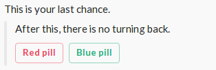

Responding to buttons
---------------------

For this example you need your own app with URL set up for Interactive Messages. If you don't have it already, please follow the steps under [Making your own app](06-making-your-own-app.md) example.

But first, let's make some assumptions to illustrate the problem better.
   
- Our application is called Matrix. Application's token is 'TOK01'
- We have one slash command /neo. Request URL is https://neo.example.com/.
- We have Interactive Message with url https://answer.example.com/.

First we create slack command and dispatcher.
```php
use ClawRock\Slack\SlackFactory;
use ClawRock\Slack\Fluent\Response\ResponseBuilder;
use ClawRock\Slack\Logic\Request\RequestInterface;
use ClawRock\Slack\Common\Enum\ActionStyle;

$dispatcher = SlackFactory::dispatcher();

$slashCommand = SlackFactory::slashCommand('TOK01');
$slashCommand->run(function (RequestInterface $req, ResponseBuilder $res) {
    $res->setUsername('Morpheus')
        ->setEmoji('eyeglasses')
        ->setText('This is your last chance.')
        ->setCallback('pill-question')
        ->createAttachment()
            ->setText('After this, there is no turning back.')
            ->createAction()
                ->setName('pills')
                ->setText('Red pill')
                ->setStyle(ActionStyle::DANGER())
                ->setValue('red-pill')
                ->setConfirm('Remember!', 'There is no turning back', 'I take it', 'I want to change')
            ->end()
            ->createAction()
                ->setName('pills')
                ->setText('Blue pill')
                ->setStyle(ActionStyle::DEFAULT_STYLE())
                ->setValue('blue-pill')
            ->end()
        ->end();
});

$messageData = $dispatcher
    ->addCommand($slashCommand)
    ->dispatch(SlackFactory::getRequest())
    ->create();

$messageData->toResponse()->serve();
```

Posting /neo on the channel will render following buttons:
 
.

If you click on "Red Pill" you will get confirmation dialog. Proceeding will send following request to https://answer.example.com/

```json
{
    "actions": [
        {
            "name": "pills",
            "value": "red-pill"
        }
    ],
    "callback_id": "pill-question",
    "team": {
        "id": "id",
        "domain": "domain"
    },
    "channel": {
        "id": "id",
        "name": "name"
    },
    "user": {
        "id": "id",
        "name": "name"
    },
    "action_ts": "1485458578.873783",
    "message_ts": "1485458400.000017",
    "attachment_id": "1",
    "token": "TOK01",
    "original_message": {
        //message you sent
    },
    "response_url": "https://hooks.slack.com/actions/xxxxxxxxx/yyyyyyyyyyyy/zzzzzzzzzzzzzzzzzzzzzzzz"
}
```

Now you can respond to this request

```php
use ClawRock\Slack\SlackFactory;

$interactiveCommand = SlackFactory::interactiveCommand('your-command-token')
    ->on('pill-question')
    ->run(SlackFactory::answer('pills', 'blue-pill')
        ->setRun(function ($req, $res) {
            $res->setText('Neo took blue pill.');
        }))
    ->run(SlackFactory::answer('pills', 'red-pill')
        ->setRun(function ($req, $res) {
            $res->setText('Neo took red pill.');
        }));

$messageData = $dispatcher
    ->addCommand($interactiveCommand)
    ->dispatch(SlackFactory::getRequest())
    ->create();

$messageData->toResponse()->serve();
```

