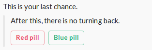

Responding to interactive elements
---------------------

Currently there are two types of interactive elements on slack.
It is Menu and Button. In order to respond for the slack query you have to use following answers:

```php
SlackFactory::answer('action name');
SlackFactory::buttonAnswer('action name', 'button value');
SlackFactory::menuAnswer('action name', 'selected option value');
```

answer will respond if the action name is correct so you should you use if you do not know the action's value or your app uses dynamic values eg. user names.

Advanced responding to buttons
---------------------

For this example you need your own app with URL set up for Interactive Messages. If you don't have it already, please follow the steps under [Making your own app](06-making-your-own-app.md) example.

But first, let's make some assumptions to illustrate the problem better.
   
- Our application is called Matrix. Application's token is 'TOK01'
- We have one slash command /neo. Request URL is https://neo.example.com/.
- We have Interactive Message with url https://answer.example.com/.

First we create slack command and dispatcher.
```php
use ClawRock\Slack\SlackFactory;
use ClawRock\Slack\Fluent\Response\ResponseBuilder;
use ClawRock\Slack\Logic\Request\RequestInterface;
use ClawRock\Slack\Common\Enum\ActionStyle;

$dispatcher = SlackFactory::dispatcher();

$slashCommand = SlackFactory::slashCommand('TOK01');
$slashCommand->run(function (RequestInterface $req, ResponseBuilder $res) {
    $res->setUsername('Morpheus')
        ->setEmoji('eyeglasses')
        ->setText('This is your last chance.')
        ->createAttachment()
            ->setCallbackId('pill-question')
            ->setText('After this, there is no turning back.')
            ->createButton()
                ->setName('pills')
                ->setText('Red pill')
                ->setStyle(ActionStyle::DANGER())
                ->setValue('red-pill')
                ->setConfirm('Remember!', 'There is no turning back', 'I take it', 'I want to change')
            ->end()
            ->createButton()
                ->setName('pills')
                ->setText('Blue pill')
                ->setStyle(ActionStyle::DEFAULT_STYLE())
                ->setValue('blue-pill')
            ->end()
        ->end();
});

$messageData = $dispatcher
    ->addCommand($slashCommand)
    ->dispatch(SlackFactory::getRequest())
    ->create();

$messageData->toResponse()->serve();
```

Posting /neo on the channel will render following buttons:
 
.

If you click on "Red Pill" you will get confirmation dialog. Proceeding will send following request to https://answer.example.com/

```json
{
    "actions": [
        {
            "name": "pills",
            "value": "red-pill"
        }
    ],
    "callback_id": "pill-question",
    "team": {
        "id": "id",
        "domain": "domain"
    },
    "channel": {
        "id": "id",
        "name": "name"
    },
    "user": {
        "id": "id",
        "name": "name"
    },
    "action_ts": "1485458578.873783",
    "message_ts": "1485458400.000017",
    "attachment_id": "1",
    "token": "TOK01",
    "original_message": {
        //message you sent
    },
    "response_url": "https://hooks.slack.com/actions/xxxxxxxxx/yyyyyyyyyyyy/zzzzzzzzzzzzzzzzzzzzzzzz"
}
```

Now you can respond to this request

```php

//ADD COMMAND BELOW TO THE DISPATCHER USING ->addCommand($interactiveCommand);

$interactiveCommand = SlackFactory::interactiveCommand('your-command-token');
$interactiveCommand->on('pill-question')
    ->run(SlackFactory::buttonAnswer('pills', 'blue-pill')
        ->setRun(function ($req, $res) {
            $res->setText('Neo took blue pill.');
        }))
    ->run(SlackFactory::buttonAnswer('pills', 'red-pill')
        ->setRun(function ($req, $res) {
            $res->setText('Neo took red pill.');
        }));
```

